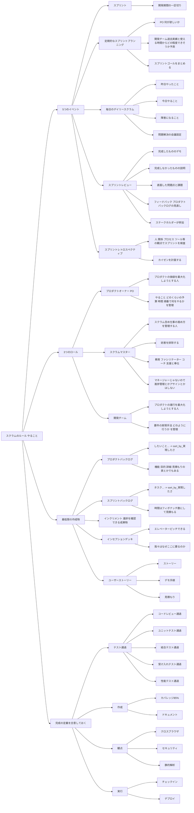

# スクラム完全に理解しました 対あり GG

## マーメイド記法で図にまとめたので良かったら見てください、あと一応mdもあります。そっちのが詳しいかも。

```mermaid
graph LR
  Scrum[スクラムのルール やること]

  Scrum  --> Events[5つのイベント]
  Events --> Sprint[スプリント]
  Sprint --> DevelopmentPeriod[開発期間の一区切り]

  Events --> Planning[定期的なスプリントプランニング]
  Planning --> POPlanning[PO 何が欲しいか ]
  Planning --> DevTeamPlanning[開発チーム過去実績と使える時間からどの程度できそうか予測]
  Planning --> SprintGoal[スプリントゴールをまとめる]

  Events --> Daily[毎日のデイリースクラム]
  Daily --> Yesterday[昨日やったこと]
  Daily --> Today[今日やること]
  Daily --> Obstacles[障害になること]
  Daily --> ProblemSolving[問題解決の会議設定]

  Events --> Review[スプリントレビュー]
  Review --> Demo[完成したもののデモ]
  Review --> IncompleteItems[完成しなかったものの説明]
  Review --> IssuesChallenges[直面した問題点と課題]
  Review --> Feedback[フィードバック プロダクトバックログの見直し]
  Review --> StakeholderParticipation[ステークホルダーが参加]

  Events --> Retro[スプリントレトロスペクティブ]
  Retro --> Inspection[人 関係 プロセス ツール等の観点でスプリントを検査]
  Retro --> Kaizen[カイゼンを計画する]

  Scrum --> Roles[3つのロール]
  Roles --> PO[プロダクトオーナー PO]
  PO --> MaximizeValue[プロダクトの価値を最大化しようとする人]
  PO --> ManageWork[やること どのくらいの予算 時間 順番で何をやるか を管理]

  Roles --> SM[スクラムマスター]
  SM --> ManageScrum[スクラム含め仕事の進め方を管理する人]
  SM --> RemoveObstacles[妨害を排除する]
  SM --> EducateFacilitate[教育 ファシリテーター コーチ 支援と奉仕]
  SM --> NotManager[マネージャーじゃないので進捗管理とかアサインとかはしない]

  Roles --> DevTeam[開発チーム]
  DevTeam --> MaximizeProgress[プロダクトの進行を最大化しようとする人]
  DevTeam --> ManageImplementation[要件の実現手法 どのように行うか を管理]


  Scrum --> Artifacts[最低限の作成物]
  Artifacts --> PBacklog[プロダクトバックログ]
  PBacklog --> Features[したいこと... -> sort_by_実現したさ]
  PBacklog --> Details[機能 目的 詳細 見積もりの表とかでもある]

  Artifacts --> SBacklog[スプリントバックログ]
  SBacklog --> Tasks[タスク... -> sort_by_実現したさ]
  SBacklog --> FibonacciEstimation[時間はフィボナッチ数にして見積もる]

  Artifacts --> Increment[インクリメント 進捗を確認できる成果物]
  Artifacts --> InceptionDeck[インセプションデッキ]
  InceptionDeck --> ElevatorPitch[エレベーターピッチできる]
  InceptionDeck --> Purpose[我々はなぜここに要るのか]

  Artifacts --> UserStory[ユーザーストーリー]
  UserStory --> Story[ストーリー]
  UserStory --> DemoProcedure[デモ手順]
  UserStory --> Estimation[見積もり]


  Scrum --> Definition[完成の定義を合意しておく]
  Definition --> Tests[テスト通過]
  Tests --> CodeReview[コードレビュー通過]
  Tests --> UnitTest[ユニットテスト通過]
  Tests --> IntegrationTest[結合テスト通過]
  Tests --> AcceptanceTest[受け入れテスト通過]
  Tests --> PerformanceTest[性能テスト通過]

  Definition --> Creation[作成]
  Creation --> Coverage[カバレッジ85%]
  Creation --> Documentation[ドキュメント]

  Definition --> Viewpoints[観点]
  Viewpoints --> CrossBrowser[クロスブラウザ]
  Viewpoints --> Security[セキュリティ]
  Viewpoints --> StaticAnalysis[静的解析]

  Definition --> Execution[実行]
  Execution --> CheckIn[チェックイン]
  Execution --> Deploy[デプロイ]

```
